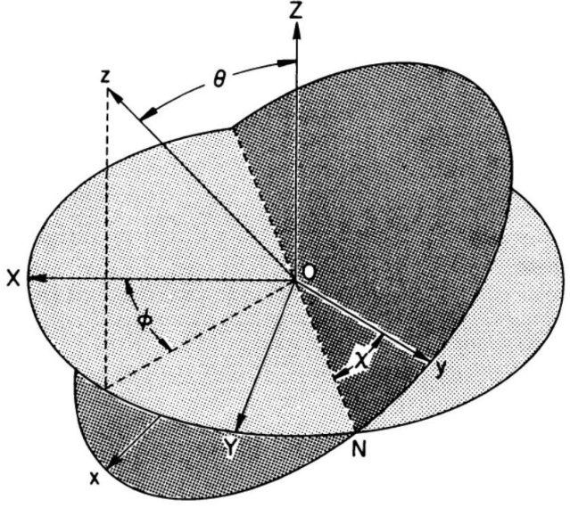
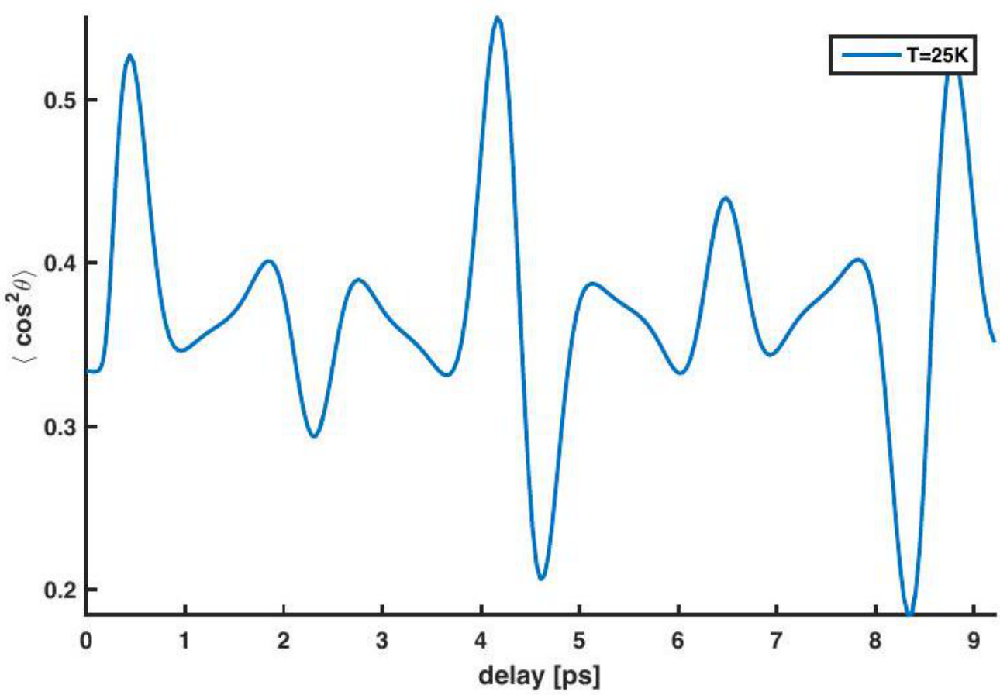
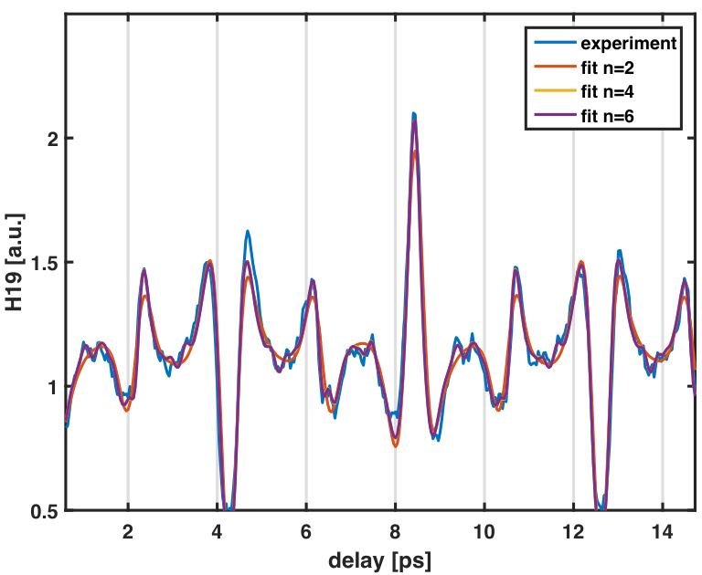

# 激光诱导分子排列产生的局部极化率  

**作者：**  
**日期：** 2024年9月3日  

## 摘要  

你的摘要。  

## 评论与想法  

**Dominik Sidler：**  
如果存在一个非共振的局部极化效应，我们预期 $I_{B}$ 会在局部略有变化（例如，如果将腔调谐到振动或电子能级）。如果腔诱导的局部极化发生，我预计它会表现为你所推导的共振条件的偏移或违反。换句话说，现在不可能让所有分子都处于同相状态，除非局部极化对每个分子都相同，而这并不是我们所预期的。在第一步中，我认为甚至不需要在腔存在的情况下重新推导你的理论。另一个有趣的问题是你的模型对分子极化率的依赖性。在你的实验装置中，你能区分腔诱导的极化率张量变化与转动惯量的变化吗？  

是否有可能将腔调谐到与转动激发共振？我认为这很难做到，因为频率非常低。如果可能的话，你需要升级你的推导，明确地包括与腔模式的耦合。这可能是一个有趣的理论任务。在这种情况下，我预计你的测量数据会受到更强的影响，但目前我还不知道实验上会观察到什么。  

**Ruggi：**  
推导确实非常出色！在没有腔的情况下，我们会有自由空间的自极化，基本上覆盖了所有极化和频率（自由空间模式是均匀且各向同性的）。然而，我认为一旦分子由于外部激光而排列，我会预期存在一个特殊的极化方向，在排列时占主导地位。因此，我们可以考虑一种自诱导（腔类）的自极化效应。我预计我们可以重新推导方程，但这次我们不使用电场 $\vec{\epsilon}$，而是将场/激光视为系统的一个主动部分，因此使用 $\vec{\epsilon}=\vec{d}-\vec{p}$，其中 $\vec{p}$ 是整个 $N_{\mathrm{mol}}$ 分子集合的极化。也就是说，我们有：  

$$
\vec{p} \approx \sum_{i=1}^{N_{\mathrm{mol}}} \lambda \vec{\epsilon^{*}} \vec{\epsilon^{*}} \cdot \vec{R_{i}}
$$

其中 $\vec{\epsilon^{*}}$ 是外部场的极化单位矢量，$\lambda$ 是耦合常数。$\lambda$ 的值是关键的，但也许我们可以通过激光脉冲的带宽和精细结构常数来估计它。它将非常小，但大量分子在相干排列时会有所帮助。  

## 1 引言  

任何分子都有三个关于三个正交轴的转动惯量 $I_{A}, I_{B}, I_{C}$，原点为中心质量。一般概念将 $I_{A}$ 描述为最小的转动惯量。我们可以根据分子的对称性将其分类：线性分子、球形分子、对称陀螺和非对称陀螺。线性分子具有典型的转动惯量比 $I_{A} < I_{B} \approx I_{C}$，其中围绕核间轴的转动惯量 $I_{A}$ 在大多数情况下可以近似为零。例如，双原子氮或氧。球形分子，如六氟化硫，在所有三个轴上具有相同的转动惯量（$I_{A} = I_{B} = I_{C}$）。对称陀螺类似于线性分子，其中两个轴具有相同的转动惯量。然而，第三个轴的转动惯量不能忽略。我们可以将对称陀螺分为扁平陀螺（$I_{A} = I_{B} < I_{C}$）和长椭球陀螺（$I_{A} < I_{B} = I_{C}$）。扁平分子呈圆盘状（例如苯），而长椭球分子呈雪茄状（例如氯甲烷）。在非对称陀螺的情况下，我们有三个不同的转动惯量（$I_{A} \neq I_{B} \neq I_{C}$）。  

---

## 量子力学中的刚性转子介绍  

在玻恩-奥本海默近似中，我们可以将系统的总波函数写为核波函数和电子波函数的乘积，并近似核的运动相对于电子的快速运动是冻结的。分子波函数可以描述为乘积：  

$$
\Phi_{\mathrm{mol}} = \Phi_{\mathrm{el}} \Phi_{\mathrm{vib}} \Phi_{\mathrm{rot}} \Phi_{\mathrm{nu.spin}}
$$

其中 $\Phi_{\mathrm{el}}$ 是电子波函数，$\Phi_{\mathrm{vib}}$ 是振动波函数，$\Phi_{\mathrm{rot}}$ 是转动波函数，$\Phi_{\mathrm{nu.spin}}$ 是核自旋波函数。每个分量可以通过为每个波函数写出单独的哈密顿量来求解。我们假设分子振动和转动的哈密顿量之间没有耦合。对于刚性转子，我们可以写出转动哈密顿量：  

$$
H_{\mathrm{rot}} = \frac{J_{a}^{2}}{2I_{a}} + \frac{J_{b}^{2}}{2I_{b}} + \frac{J_{c}^{2}}{2I_{c}} = A J_{a}^{2} + B J_{b}^{2} + C J_{c}^{2}
$$

其中 $J_{a,b,c}$ 是角动量算符，$A, B,$ 和 $C$ 是围绕每个轴的转动频率。在氮的情况下，我们得到一个一维刚性转子，因为围绕 b 轴和 c 轴的转动是相同的，无法区分。氮的内部哈密顿量为：  

$$
H_{\mathrm{rot}} = \frac{J^{2} \hbar^{2}}{2I_{B}}
$$

通过薛定谔方程：  

$$
H_{\mathrm{rot}} \Phi = E \Phi
$$

我们得到转动态的能量：  

$$
E_{n} = \frac{j(j+1)h^{2}}{8\pi^{2}I_{B}}
$$

可以写为 $E_{n} = j(j+1)B h$，其中 $B$ 是转动常数。使用转动态的能量，我们可以估计转动态的配分函数：  

$$
\xi = \sum_{J_{i}} e^{-E_{J_{i}}/kT}
$$

它描述了转动系统的统计性质。  

---

## 在外场中的粒子  

当原子或分子处于强度为 $\bar{\epsilon}$ 的电场中时，系统的能量 $U$ 可以用泰勒展开表示：  

$$
U = U_{0} - \mu_{\mathrm{perm}} \epsilon_{i} - \frac{1}{2} \alpha_{ij} \epsilon_{i} \epsilon_{j} - \frac{1}{6} \beta_{ijk} \epsilon_{i} \epsilon_{j} \epsilon_{k} - \frac{1}{24} \gamma_{ijkl} \epsilon_{i} \epsilon_{j} \epsilon_{k} \epsilon_{l}
$$

其中 $U_{0}$ 是无扰动能量，$\mu_{\mathrm{perm}}$ 是永久偶极矩，$\alpha$ 是极化率，$\beta$ 和 $\gamma$ 是第一和第二超极化率，$i, j, k$ 是笛卡尔坐标系中的坐标。在本文讨论的分子和技术中，氮和乙烯的永久偶极矩和超极化率在多周期激光场中被抵消，因为每个半周期引入的效果与相邻半周期的效果相反。系统的能量可以描述为：  

$$
U = U_{0} - \frac{1}{2} \alpha_{ij} \epsilon_{i} \epsilon_{j}
$$

  
**图1：** 分子框架和实验室框架的定义  

其中系统的能量仅受与感应偶极子 $\mu_{ij} = \alpha_{ij} \epsilon_{i}$ 的相互作用影响。极化率 $\alpha$ 是一个 $3 \times 3$ 的张量：  

$$
\boldsymbol{\alpha} = \begin{bmatrix}
\alpha_{XX} & \alpha_{XY} & \alpha_{XZ} \\
\alpha_{YX} & \alpha_{YY} & \alpha_{YZ} \\
\alpha_{ZX} & \alpha_{ZY} & \alpha_{ZZ}
\end{bmatrix}
$$

实验室框架中的感应偶极矩 $\mu_{i} = \sum \alpha_{ij} \epsilon_{i}$ 为：  

$$
\begin{bmatrix}
\mu_{X} \\
\mu_{Y} \\
\mu_{Z}
\end{bmatrix} = \begin{bmatrix}
\alpha_{XX} & \alpha_{XY} & \alpha_{XZ} \\
\alpha_{YX} & \alpha_{YY} & \alpha_{YZ} \\
\alpha_{ZX} & \alpha_{ZY} & \alpha_{ZZ}
\end{bmatrix} \cdot \begin{bmatrix}
\epsilon_{X} \\
\epsilon_{Y} \\
\epsilon_{Z}
\end{bmatrix}
$$

我们需要从分子固定框架到实验室框架进行变换，因为我们只能在分子固定框架中计算分子的极化率，其坐标系为 $x, y, z$。变换使用方向余弦矩阵进行：  

$$
\Phi(\phi, \theta, \chi) = R_{z}(\chi) R_{y}(\theta) R_{z}(\phi)
$$

其中 $\phi$ 是实验室框架中围绕 Z 轴的旋转，$\theta$ 是围绕分子轴 $y$ 的旋转，$\chi$ 是围绕分子 $z$ 轴的旋转。欧拉角和旋转函数的定义可以从 [62] 中找到，如图 3.3 所示。对于分子轴围绕 $z$ 轴的线性转子，且电场在 Z 轴方向上有分量，我们得到仅在 Z 方向上的感应偶极矩：  

$$
\mu_{Z} = \mu_{x} \sin \theta \cos \chi + \mu_{y} \sin \theta \sin \chi + \mu_{z} \cos \theta
$$

其中 $\mu_{x} = \sin \theta \cos \chi \epsilon_{Z} \alpha_{xx}$，这导致实验室感应偶极矩为：  

$$
\mu_{Z} = \alpha_{xx} \epsilon_{Z} \sin^{2} \theta \cos^{2} \chi + \alpha_{yy} \epsilon_{Z} \sin^{2} \theta \sin^{2} \chi + \alpha_{zz} \epsilon_{Z} \cos^{2} \theta
$$

我们将其重写为：  

$$
\mu_{Z} = \alpha_{\perp} \epsilon_{Z} \sin^{2} \theta + \alpha_{\parallel} \epsilon_{Z} \cos^{2} \theta
$$

并使用新变量 $\Delta \alpha = \alpha_{\parallel} \epsilon_{Z} - \alpha_{\perp} \epsilon_{Z}$ 来写：  

$$
\mu_{Z} = \Delta \alpha \epsilon_{Z} \cos^{2} \theta + \alpha_{\perp} \epsilon_{Z}
$$

根据上述描述并使用公式 3.66，我们可以写出感应哈密顿量：  

$$
H_{\mathrm{ind}}(t) = \left( \Delta \alpha \cos^{2} \theta + \alpha_{\perp} \right) \cdot F^{2}(t) \hat{Z}
$$

其中 $F(t) = \frac{1}{2} \epsilon(t) \cos \omega t$，$\epsilon(t)$ 描述了电场随时间变化的包络，我们得到：  

$$
H_{\mathrm{ind}}(t) = \left( \Delta \alpha \cos^{2} \theta + \alpha_{\perp} \right) \cdot \frac{\epsilon^{2}(t)}{4} \hat{Z}
$$

---

## 外电场中的线性刚性转子  

为了描述在外场影响下的系统，我们求解含时薛定谔方程（TDSE）。激光脉冲与分子相互作用的哈密顿量为：  

$$
H(t) = H_{\mathrm{rot}} + H_{\mathrm{ind}}(t)
$$

其中 $H_{\mathrm{rot}}$ 是公式 3.60 中描述的无场哈密顿量，$H_{\mathrm{ind}}$ 是公式 3.78 中描述的感应哈密顿量。我们假设激光脉冲的持续时间远短于分子的转动常数 $B$，即 $\tau \ll \frac{\hbar}{B}$，其中 $\tau$ 定义为高斯脉冲的半高全宽，当信号下降到 $1/e$ 时，包络为 $\epsilon(t) = e^{t^{2}/\tau^{2}}$。TDSE 可以写为：  

$$
i \hbar \frac{\partial \Psi}{\partial t} = \hat{H} \Psi
$$

我们可以使用正交基组找到 TDSE 的解：  

$$
|\Psi\rangle = C_{M}^{J} | J M \rangle
$$

其中系数 $C_{JM}$ 是时间相关的，我们可以将 TDSE 写为：  

$$
i \hbar \dot{C} = \sum_{J,M} C_{M}^{J}(t) \left( \langle J M | H_{\mathrm{rot}} | J' M' \rangle + \langle J M | H_{\mathrm{ind}} | J' M' \rangle \right)
$$

其中 $J', M'$ 是初始转动态，$J, M$ 是与电场相互作用后的占据态。我们插入转动哈密顿量的形式并插入感应哈密顿量的精确公式，得到：  

$$
i \hbar \sum_{J,M} \dot{C} = \sum_{J,M} C_{M}^{J}(t) \left( E_{J J'} \delta_{J J'} - \frac{\epsilon^{2}(t) \Delta \alpha}{4} \langle J M | \cos^{2} \theta | J' M' \rangle - \frac{\epsilon^{2}(t) \alpha_{\perp}}{4} \langle J M | J' M' \rangle \right)
$$

其中 $\delta_{J,J'}$ 是克罗内克 δ 函数，方程变为：  

$$
\sum_{J,M} \dot{C}_{M}^{J}(t) = -\frac{i}{\hbar} \sum_{J,M} C_{M}^{J}(t) \left( E_{J' J'} \delta_{J' J} - \frac{\epsilon^{2}(t) \alpha_{\perp}}{4} \delta_{J' J} - \frac{\epsilon^{2}(t) \Delta \alpha}{4} \langle J' M' | \cos^{2} \theta | J M \rangle \right)
$$

我们需要从方程中解出最后一个求和项，以找到系数 $C_{M}^{J}(t)$ 的解。在将 $\cos^{2} \theta$ 重写为球谐函数时，我们得到：  

$$
\langle J' M' | \cos^{2} \theta | J M \rangle = \frac{1}{3} \delta_{J' J} + \frac{4}{3} \sqrt{\frac{\pi}{5}} \langle J' M' | J=2, M=0 | J M \rangle
$$

$$
= \frac{1}{3} \delta_{J' J} + \frac{2}{3} \sqrt{(2J'+1)(2J+1)} \begin{pmatrix} J' & 2 & J \\ 0 & 0 & 0 \end{pmatrix} \begin{pmatrix} J' & 2 & J \\ M' & 0 & M \end{pmatrix}
$$

其中最后两个括号是 Wigner 3-j 符号，用于将初始态的角动量 $J = 2$ 添加到最终态。将公式 3.85 代入公式 3.84，我们可以写出时间相关系数的解：  

$$
\sum_{J,M} \dot{C}_{M}^{J}(t) = -\frac{i}{\hbar} \sum_{J,M} C_{M}^{J}(t) \left( E_{J',J} \delta_{J',J} - \frac{\epsilon^{2}(t) \alpha_{\perp}}{4} \delta_{J',J} \right.
$$

$$
\left. - \frac{\epsilon^{2}(t) \Delta \alpha}{4} \left( \frac{1}{3} \delta_{J',J} + \frac{2}{3} \sqrt{(2J+1)(2J'+1)} \begin{pmatrix} J' & 2 & J \\ 0 & 0 & 0 \end{pmatrix} \begin{pmatrix} J' & 2 & J \\ M' & 0 & M \end{pmatrix} \right) \right)
$$

这种形式的常微分方程 $\dot{C} = C(t,J)$ 使用 MATLAB 的 `ode45` 函数求解，基于 Dormand-Prince 方法，一种显式的龙格-库塔方法。对于电场中的每个时间步，计算系数数组并用于下一个时间步。系数的平方等于相应 J 态的占据数。公式 3.86 中的系数在 $\Delta J = -2, 0, 2$ 时为零。拉曼跃迁遵循这些规则，我们可以将转动激发描述为一系列拉曼跃迁。在脉冲期间，这些跃迁是相干的，得到的系数 $C_{M}^{J}$ 是实数值。在激光脉冲之后，我们通过求解无场哈密顿量的含时薛定谔方程来计算波函数的时间相关行为。解为：  

$$
|\Psi(t)\rangle = \sum_{J'} C_{J'M}(t_{e}) | J' M \rangle e^{-i E_{J'}(t - t_{e})/\hbar}
$$

其中 $t_{e}$ 是激光脉冲结束的时间，$E_{J'}$ 是无场哈密顿量的本征能量。从公式 3.87，我们可以定义波包中 J 态依赖的相位：  

$$
\phi_{J} = E_{J} \Delta t / \hbar = 2\pi (B J(J+1)) \Delta t
$$

并查看相邻 J 态的相位差：  

$$
\phi_{J} - \phi_{J-1} = 2\pi (2B \Delta t) J
$$

其中 $\Delta t$ 是脉冲结束与当前时间之间的时间差。如果我们现在将时间延迟 $\Delta t$ 设为 $T_{\mathrm{rev}} = 1/(2B)$，我们会看到所有 J 态具有相同的相位，导致完全恢复，所有激发态与外部场的极化方向对齐。在 $t = 1/(4B)$ 时，相邻态的相位偏移为 $\pi$，导致半恢复，转动态指向相反方向，但无法区分。在时间 $T_{\mathrm{rev}} \cdot p/q$ 时，$q = 1, 2, 4$，可能会发生部分恢复。然而，计算表明在 $t = 1/(8B)$ 时不会发生恢复，相邻态的相位差为 $\pi/2$，因此偶数 J 态与激光极化反向对齐，而奇数 J 态与激光极化同向对齐，并与极化方向平行。由于双原子氮中的自旋统计，我们仍然可以在这个特定时间观察到恢复。由于 2:1 的比例，更多的偶数态在这个特定时间与激光场反向对齐，导致恢复程度降低，而在 $t = 1/(2B) - 1/(8B)$ 时，更多的态与激光对齐，并且对齐度达到峰值。这些行为如图 3.4 所示，我们绘制了与激光脉冲相互作用后随时间变化的 $\langle \cos^{2} \theta \rangle$ 值。我们使用 $\langle \cos^{2} \theta \rangle$ 的期望值作为对齐度的度量，其中 $\langle \cos^{2} \theta \rangle$ 描述了分子轴与激光极化的重叠。  

---

## 2 偶极自相互作用修正  

在下一步中，我将引入由于腔量子电动力学中的偶极自相互作用产生的小修正项。原则上，这个项不仅存在于腔中，也存在于自由空间中。然而，在这种情况下，前置因子将非常小。从腔中的集体强耦合中，我们知道，即使耦合常数相对较小，许多（宏观数量）分子的同相/相关运动（极化）也可以引起局部分子变化。可能现在在强激光驱动下，许多分子在相位上极化，这可能会抵消微小的耦合。类似于光腔中的集体强耦合，通常通过使用单个分子与人工增加的耦合常数 $\lambda$ 强耦合来模拟，我们将在以下内容中引入一个额外的偶极-偶极相互作用项，其中耦合常数将用作实验数据的拟合参数。  

  
**图2：** 双原子氮的分子对齐随无场时间的函数，用期望值 $\langle \cos^{2} \theta \rangle$ 表示，转动温度为 $T = 25 \, \mathrm{K}$，用 80 fs 和 $20 \, \mathrm{TW/cm^{2}}$ 的单脉冲激发转动。  

  
**图3：** 实验测量的 N2 时间相关对齐轨迹示例。拟合使用理论模型：  

$$
H_{\mathrm{self}} = \lambda^{2} \mu_{Z}^{2} = \lambda^{2} \left( \Delta \alpha \cos^{2} \theta + \alpha_{\perp} \right)^{2} \cdot \frac{\epsilon^{2}(t)}{4} = \lambda^{2} \left( \Delta \alpha^{2} \cos^{4} \theta + 2 \alpha_{\perp} \Delta \alpha \cos^{2} \theta + \alpha_{\perp}^{2} \right) \cdot \frac{\epsilon^{2}(t)}{4}.
$$

仔细检查右侧，因为我并不完全确定是否正确理解了时间相关场的定义，但在类比中应该是正确的。使用与上述相同的论点，我们发现对于 $H(t) = H_{\mathrm{rot}} + H_{\mathrm{self}} + H_{\mathrm{ind}}(t)$ 的 TDSE，系数为：  

$$
\sum_{J,M} \dot{C}_{M}^{J}(t) = -\frac{i}{\hbar} \sum_{J,M} C_{M}^{J}(t) \left[ \left( E_{J' J'} - \frac{\epsilon^{2}(t) (1 - \lambda^{2} \alpha_{\perp}) \alpha_{\perp}}{4} \right) \delta_{J' J} \right.
$$

$$
\left. - \frac{\epsilon^{2}(t) (1 - 2 \lambda^{2} \alpha_{\perp}) \Delta \alpha}{4} \langle J' M' | \cos^{2} \theta | J M \rangle + \frac{\lambda^{2} \epsilon^{2}(t) \Delta \alpha^{2}}{4} \langle J' M' | \cos^{4} \theta | J M \rangle \right]
$$

不确定符号是否正确，但偶极自能必须严格为正。虽然前两行在定性上与原始问题相同，其中只有极化率被偶极自能修改，但最后一项将引入新的物理，因为它具有不同的 Clebsch-Gordan 选择规则。然而，整体问题与原始问题非常相似，因此对于一个小的但不可忽略的 $\lambda$ 参数，我预计动力学会非常接近原始问题，但会有小的偏差，这可能会缩小实验与理论之间的差距。在以下内容中，我们展示了最后一项 $\langle J' M' | \cos^{4} \theta | J M \rangle$ 将选择规则从 $\Delta J = -2, 0, 2$ 扩展到 $M = M' = 0$ 的 $\Delta J = -4, -2, 0, 2, 4$。利用勒让德多项式的性质，我们发现 $\cos^{4} \theta = 8/35 P_{4}(\cos \theta) + 20/35 P_{2}(\cos \theta) + 13/35$，并且知道球谐函数 $Y_{J}^{0} = \sqrt{(2J+1)/4\pi} P_{J}$，我们得到：  

$$
\langle J' M' | P_{4} | J M \rangle = \sqrt{\frac{2J' + 1}{2J + 1}} \langle J' 0 4 0 | J 0 \rangle \langle J' M' 4 0 | J M \rangle
$$

$$
= \sqrt{(2J' + 1)(2J + 1)} \begin{pmatrix} J' & 4 & J \\ 0 & 0 & 0 \end{pmatrix} \begin{pmatrix} J' & 4 & J \\ M' & 0 & M \end{pmatrix}
$$

$$
\langle J' M' | P_{2} | J M \rangle = \sqrt{(2J' + 1)(2J + 1)} \begin{pmatrix} J' & 2 & J \\ 0 & 0 & 0 \end{pmatrix} \begin{pmatrix} J' & 2 & J \\ M' & 0 & M \end{pmatrix}
$$

其中我们使用了 Wigner 3-j 符号表示的球面积分的 Clebsch-Gordon 表示。从这里开始，我不太确定如何继续，因为我没有完全理解 EQS. (26)-(28) 中的论点。也许在你的现有代码中实现这些非常容易？  

---

## 参考文献  

（在此处添加参考文献）

---

此版本纠正了拼写错误，提高了可读性，并确保了文档中的格式一致性。