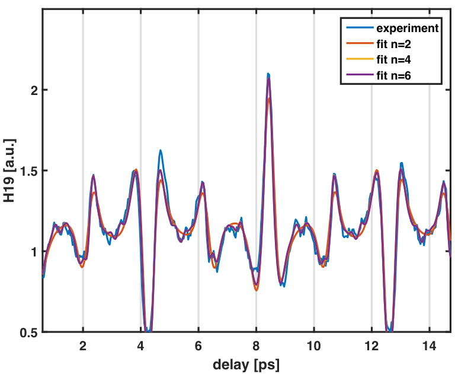

# On Local Polarizabilities Created by Laser-Induced Molecular Alignment  

**Author:**  
**Date:** September 3, 2024  

## Abstract  

Your abstract.  

## Comments and Ideas  

**Dominik Sidler:**  
If there is an off-resonance local polarization effect, one would expect that $I_{B}$ changes locally slightly (e.g., if one tunes the cavity on vibrations or the electronic energy regime). If cavity-induced local polarization happens, I would expect it to appear as a violation or detuning of the resonance condition that you derived. In other words, it is now impossible to have all molecules in phase, except if the local polarization is the same for every molecule, which we do not expect. In a first step, I guess one would not even need to re-derive your theory in the presence of a cavity. Another interesting aspect is the dependency of your model on the molecular polarizability. Can you distinguish in your setup cavity-induced modifications that arise from a changed polarizability tensor versus changes in the moment of inertia?  

Is it possible to tune a cavity on resonance with the rotational excitations? I guess this is tricky to do, since the frequency is very low. If possible, one would need to upgrade your derivations to explicitly include the coupling to the cavity modes. This could be an interesting theoretical task. Probably in that case, an even stronger impact on your measured data is expected, but at the moment I don’t know what to expect experimentally.  

**Ruggi:**  
The derivations are very nice indeed! Without a cavity, we will have the free-space self-polarization essentially over all polarizations and frequencies (free-space modes are homogeneous and isotropic). However, I think that once they are aligned due to an external laser, I expect that there is one polarization direction that is special and dominant while aligned. So I guess we can think about a self-induced (cavity-like) self-polarization effect. I would expect that we could think about re-deriving the equation, but this time we do not use the electric field $\vec{\epsilon}$, but treat the field/laser as an active part of the system and hence use $\vec{\epsilon}=\vec{d}-\vec{p}$, where $\vec{p}$ is the polarization of the full ensemble of $N_{\mathrm{mol}}$ molecules. That is, we would have  

$$
\vec{p} \approx \sum_{i=1}^{N_{\mathrm{mol}}} \lambda \vec{\epsilon^{*}} \vec{\epsilon^{*}} \cdot \vec{R_{i}}
$$

where $\vec{\epsilon^{*}}$ is the unit vector of polarization of the external field and $\lambda$ is a coupling constant. The value of $\lambda$ is critical, but maybe we can estimate it using the bandwidth of the laser pulse and the fine-structure constant. It will be very tiny, but the number of molecules that are coherently aligned will help.  

---

## 1 Introduction  

Any molecule has three moments of inertia $I_{A}, I_{B}, I_{C}$ about three orthogonal axes, with the center of mass as the origin. The general notion describes $I_{A}$ as the smallest moment of inertia. We can categorize molecules based on their symmetry: linear molecules, spherical molecules, symmetric tops, and asymmetric tops. Linear molecules have a typical ratio between the moments of inertia of $I_{A} < I_{B} \approx I_{C}$, where the moment of inertia $I_{A}$ around the internuclear axis can be approximated to be zero in most cases. Examples include diatomic nitrogen or oxygen. Spherical molecules, such as sulfur hexafluoride, have the same moment of inertia in all three axes ($I_{A} = I_{B} = I_{C}$). Symmetric tops are similar to linear molecules, where two axes have the same moment of inertia. However, the third axis has a moment of inertia that cannot be neglected. We can divide symmetric tops into groups of oblate ($I_{A} = I_{B} < I_{C}$) and prolate symmetric tops ($I_{A} < I_{B} = I_{C}$). Oblate molecules are disc-shaped (e.g., benzene), and prolate molecules are more cigar-shaped (e.g., chloromethane). In the case of asymmetric tops, we have three different moments of inertia ($I_{A} \neq I_{B} \neq I_{C}$).  

---

## Introduction to the Rigid Rotor in Quantum Mechanics  

In the Born-Oppenheimer approximation, we can write the total wave function of our system as the product of the wave function of the nucleus and of the electrons, and approximate the motion of the nucleus to be frozen compared to the fast motion of the electrons around it. The molecular wave function is described as the product:  

$$
\Phi_{\mathrm{mol}} = \Phi_{\mathrm{el}} \Phi_{\mathrm{vib}} \Phi_{\mathrm{rot}} \Phi_{\mathrm{nu.spin}}
$$

where $\Phi_{\mathrm{el}}$ is the electronic wave function, $\Phi_{\mathrm{vib}}$ the vibrational wave function, $\Phi_{\mathrm{rot}}$ the rotational wave function, and $\Phi_{\mathrm{nu.spin}}$ the wave function of nuclear spins. Each component can be solved by writing the individual Hamiltonian for each wave function. We assume no coupling between the vibrational and rotational Hamiltonian of the molecule. For a rigid rotor, we can write the rotational Hamiltonian:  

$$
H_{\mathrm{rot}} = \frac{J_{a}^{2}}{2I_{a}} + \frac{J_{b}^{2}}{2I_{b}} + \frac{J_{c}^{2}}{2I_{c}} = A J_{a}^{2} + B J_{b}^{2} + C J_{c}^{2}
$$

where $J_{a,b,c}$ are angular momentum operators and $A, B,$ and $C$ are the frequencies of rotation about each axis. In the case of nitrogen, we get a one-dimensional rigid rotor, since the rotation around the b-axis and c-axis are identical and cannot be distinguished. The internal Hamiltonian for nitrogen is:  

$$
H_{\mathrm{rot}} = \frac{J^{2} \hbar^{2}}{2I_{B}}
$$

With the Schrödinger equation:  

$$
H_{\mathrm{rot}} \Phi = E \Phi
$$

we get the energy of the rotational states:  

$$
E_{n} = \frac{j(j+1)h^{2}}{8\pi^{2}I_{B}}
$$

which can be written as $E_{n} = j(j+1)B h$ with the rotational constant $B$. Using the energy of the rotational states, we can estimate the partition function of the rotational states:  

$$
\xi = \sum_{J_{i}} e^{-E_{J_{i}}/kT}
$$

which describes the statistical properties of the rotational system.  

---

## Particle in an External Field  

When an atom or molecule is in an electric field of strength $\bar{\epsilon}$, the energy $U$ of the system can be expressed in a Taylor expansion:  

$$
U = U_{0} - \mu_{\mathrm{perm}} \epsilon_{i} - \frac{1}{2} \alpha_{ij} \epsilon_{i} \epsilon_{j} - \frac{1}{6} \beta_{ijk} \epsilon_{i} \epsilon_{j} \epsilon_{k} - \frac{1}{24} \gamma_{ijkl} \epsilon_{i} \epsilon_{j} \epsilon_{k} \epsilon_{l}
$$

where $U_{0}$ is the unperturbed energy, $\mu_{\mathrm{perm}}$ is the permanent dipole moment, $\alpha$ is the polarizability, and $\beta$ and $\gamma$ are the first and second hyperpolarizabilities, with $i, j, k$ coordinates in the Cartesian coordinate system. In the case of the molecules and techniques treated in this thesis, the permanent dipole moment and hyperpolarizability of nitrogen and ethylene wash out over the multi-cycle laser fields, as each half cycle introduces an effect opposite to the adjacent half cycle. The energy of the system is then described as:  

$$
U = U_{0} - \frac{1}{2} \alpha_{ij} \epsilon_{i} \epsilon_{j}
$$

  
**Figure 1:** Definition of molecular frame and laboratory frame  

where the energy of the system is only influenced by the interaction with the induced dipole $\mu_{ij} = \alpha_{ij} \epsilon_{i}$. The polarizability $\alpha$ is a $3 \times 3$ tensor given by:  

$$
\boldsymbol{\alpha} = \begin{bmatrix}
\alpha_{XX} & \alpha_{XY} & \alpha_{XZ} \\
\alpha_{YX} & \alpha_{YY} & \alpha_{YZ} \\
\alpha_{ZX} & \alpha_{ZY} & \alpha_{ZZ}
\end{bmatrix}
$$

and the induced dipole moment $\mu_{i} = \sum \alpha_{ij} \epsilon_{i}$ in the lab frame is:  

$$
\begin{bmatrix}
\mu_{X} \\
\mu_{Y} \\
\mu_{Z}
\end{bmatrix} = \begin{bmatrix}
\alpha_{XX} & \alpha_{XY} & \alpha_{XZ} \\
\alpha_{YX} & \alpha_{YY} & \alpha_{YZ} \\
\alpha_{ZX} & \alpha_{ZY} & \alpha_{ZZ}
\end{bmatrix} \cdot \begin{bmatrix}
\epsilon_{X} \\
\epsilon_{Y} \\
\epsilon_{Z}
\end{bmatrix}
$$

where we have to perform a transformation from the molecule-fixed frame to the laboratory frame, since we are only able to calculate the polarizability of the molecule in the molecule-fixed frame, given by its coordinate system $x, y, z$. The transformation is performed using the direction cosine matrix:  

$$
\Phi(\phi, \theta, \chi) = R_{z}(\chi) R_{y}(\theta) R_{z}(\phi)
$$

where $\phi$ is a rotation about the Z axis in the lab frame, $\theta$ a rotation about the molecular axis $y$, and $\chi$ the rotation about the molecular $z$ axis. Definitions for the Euler angles and rotation functions can be taken from [62] and are shown in Figure 3.3. For a linear rotor with the molecular axis around the $z$ axis and an electric field with a component in the Z-axis, we get an induced dipole moment only in the Z direction:  

$$
\mu_{Z} = \mu_{x} \sin \theta \cos \chi + \mu_{y} \sin \theta \sin \chi + \mu_{z} \cos \theta
$$

with $\mu_{x} = \sin \theta \cos \chi \epsilon_{Z} \alpha_{xx}$, which results in a laboratory induced dipole moment:  

$$
\mu_{Z} = \alpha_{xx} \epsilon_{Z} \sin^{2} \theta \cos^{2} \chi + \alpha_{yy} \epsilon_{Z} \sin^{2} \theta \sin^{2} \chi + \alpha_{zz} \epsilon_{Z} \cos^{2} \theta
$$

which we re-write to:  

$$
\mu_{Z} = \alpha_{\perp} \epsilon_{Z} \sin^{2} \theta + \alpha_{\parallel} \epsilon_{Z} \cos^{2} \theta
$$

and use a new variable with $\Delta \alpha = \alpha_{\parallel} \epsilon_{Z} - \alpha_{\perp} \epsilon_{Z}$ to write:  

$$
\mu_{Z} = \Delta \alpha \epsilon_{Z} \cos^{2} \theta + \alpha_{\perp} \epsilon_{Z}
$$

Following the above description and using Equation 3.66, we can write the induced Hamiltonian as:  

$$
H_{\mathrm{ind}}(t) = \left( \Delta \alpha \cos^{2} \theta + \alpha_{\perp} \right) \cdot F^{2}(t) \hat{Z}
$$

with $F(t) = \frac{1}{2} \epsilon(t) \cos \omega t$, where $\epsilon(t)$ describes the envelope of the electric field as a function of time, and we get:  

$$
H_{\mathrm{ind}}(t) = \left( \Delta \alpha \cos^{2} \theta + \alpha_{\perp} \right) \cdot \frac{\epsilon^{2}(t)}{4} \hat{Z}
$$

---

## A Linear Rigid Rotor in an External Electric Field  

To describe the system under the influence of the external field, we solve the time-dependent Schrödinger equation (TDSE). The Hamiltonian for the interaction between the laser pulse and the molecule is given by:  

$$
H(t) = H_{\mathrm{rot}} + H_{\mathrm{ind}}(t)
$$

where $H_{\mathrm{rot}}$ is the field-free Hamiltonian described in Equation 3.60 and $H_{\mathrm{ind}}$ the induced Hamiltonian described in Equation 3.78. We assume that the laser pulse duration is significantly shorter than the rotational constant of the molecule, $B$, i.e., $\tau \ll \frac{\hbar}{B}$, with $\tau$ defined as the full width at half maximum of a Gaussian pulse, when the signal drops to $1/e$ with the envelope $\epsilon(t) = e^{t^{2}/\tau^{2}}$. The TDSE can be written as:  

$$
i \hbar \frac{\partial \Psi}{\partial t} = \hat{H} \Psi
$$

and we can find solutions to the TDSE using the orthonormal basis set:  

$$
|\Psi\rangle = C_{M}^{J} | J M \rangle
$$

where the coefficients $C_{JM}$ are time-dependent and we can write the TDSE as:  

$$
i \hbar \dot{C} = \sum_{J,M} C_{M}^{J}(t) \left( \langle J M | H_{\mathrm{rot}} | J' M' \rangle + \langle J M | H_{\mathrm{ind}} | J' M' \rangle \right)
$$

where $J', M'$ are the initial rotational states and $J, M$ the occupied states after the interaction with the electric field. We insert the formalism for the rotational Hamiltonian and insert the exact formula of the induced Hamiltonian, so that:  

$$
i \hbar \sum_{J,M} \dot{C} = \sum_{J,M} C_{M}^{J}(t) \left( E_{J J'} \delta_{J J'} - \frac{\epsilon^{2}(t) \Delta \alpha}{4} \langle J M | \cos^{2} \theta | J' M' \rangle - \frac{\epsilon^{2}(t) \alpha_{\perp}}{4} \langle J M | J' M' \rangle \right)
$$

where $\delta_{J,J'}$ is a Kronecker delta and the equation turns into:  

$$
\sum_{J,M} \dot{C}_{M}^{J}(t) = -\frac{i}{\hbar} \sum_{J,M} C_{M}^{J}(t) \left( E_{J' J'} \delta_{J' J} - \frac{\epsilon^{2}(t) \alpha_{\perp}}{4} \delta_{J' J} - \frac{\epsilon^{2}(t) \Delta \alpha}{4} \langle J' M' | \cos^{2} \theta | J M \rangle \right)
$$

where we now have to solve the last summand out of the equation to find a solution for the coefficients $C_{M}^{J}(t)$. Solving the summand, while rewriting $\cos^{2} \theta$ as a spherical harmonic, we get:  

$$
\langle J' M' | \cos^{2} \theta | J M \rangle = \frac{1}{3} \delta_{J' J} + \frac{4}{3} \sqrt{\frac{\pi}{5}} \langle J' M' | J=2, M=0 | J M \rangle
$$

$$
= \frac{1}{3} \delta_{J' J} + \frac{2}{3} \sqrt{(2J'+1)(2J+1)} \begin{pmatrix} J' & 2 & J \\ 0 & 0 & 0 \end{pmatrix} \begin{pmatrix} J' & 2 & J \\ M' & 0 & M \end{pmatrix}
$$

where the two brackets at the end are Wigner 3-j symbols to add the angular momentum $J = 2$ from the initial state to the final state. Inserting Equation 3.85 into Equation 3.84, we can write the solution for the time-dependent coefficients as:  

$$
\sum_{J,M} \dot{C}_{M}^{J}(t) = -\frac{i}{\hbar} \sum_{J,M} C_{M}^{J}(t) \left( E_{J',J} \delta_{J',J} - \frac{\epsilon^{2}(t) \alpha_{\perp}}{4} \delta_{J',J} \right.
$$

$$
\left. - \frac{\epsilon^{2}(t) \Delta \alpha}{4} \left( \frac{1}{3} \delta_{J',J} + \frac{2}{3} \sqrt{(2J+1)(2J'+1)} \begin{pmatrix} J' & 2 & J \\ 0 & 0 & 0 \end{pmatrix} \begin{pmatrix} J' & 2 & J \\ M' & 0 & M \end{pmatrix} \right) \right)
$$

This ordinary differential equation of the form $\dot{C} = C(t,J)$ is solved using the MATLAB `ode45` function, based on the Dormand-Prince method, an explicit Runge-Kutta method. For each time step in the electric field, an array of coefficients is calculated and used for the next time step. The square of the coefficients is equal to the population of the corresponding J state. The coefficients in Equation 3.86 will be zero unless $\Delta J = -2, 0, 2$. Raman transitions follow these rules, and we can describe the rotational excitation as a series of Raman transitions. During the pulse, these transitions happen coherently, and the resulting coefficient $C_{M}^{J}$ are real values. After the laser pulse, we calculate the time-dependent behavior of the wave function by solving the time-dependent Schrödinger equation for the field-free Hamiltonian. The solution is:  

$$
|\Psi(t)\rangle = \sum_{J'} C_{J'M}(t_{e}) | J' M \rangle e^{-i E_{J'}(t - t_{e})/\hbar}
$$

with $t_{e}$ the time at the end of the laser pulse and $E_{J'}$ the eigenenergies of the field-free Hamiltonian. From Equation 3.87, we can define a J-state-dependent phase in the wave packet:  

$$
\phi_{J} = E_{J} \Delta t / \hbar = 2\pi (B J(J+1)) \Delta t
$$

and look at the phase difference of neighboring J states:  

$$
\phi_{J} - \phi_{J-1} = 2\pi (2B \Delta t) J
$$

where $\Delta t$ is given as the time difference between the end of the pulse and the current time. If we now set the time delay $\Delta t$ to be $T_{\mathrm{rev}} = 1/(2B)$, we see that all J-states have the same phase, resulting in a full revival, and all excited states align with the polarization direction of the external field. At $t = 1/(4B)$, the neighboring states have a phase offset of $\pi$, resulting in a half revival, where rotational states point in opposite directions but are indistinguishable. Fractional revivals at times $T_{\mathrm{rev}} \cdot p/q$ with $q = 1, 2, 4$ can occur. However, calculations expect no revival at times of $t = 1/(8B)$, where neighboring states have a phase difference of $\pi/2$, so even J-states anti-align with the laser polarization, while odd states align with the laser polarization and are parallel to the polarization direction. Due to the spin-statistics in diatomic nitrogen, we can still observe a revival at this particular time. With a ratio of 2:1, more even states anti-align at this particular time with the laser field, resulting in a revival with a reduced degree of alignment, while then at a time of $t = 1/(2B) - 1/(8B)$, more states align with the laser, and a peak in the alignment is visible. These behaviors are shown in Figure 3.4, where we plot the time-dependent value of $\langle \cos^{2} \theta \rangle$ as a function of time after the interaction with a laser pulse. We use the expectation of $\langle \cos^{2} \theta \rangle$ as a metric to describe the degree of alignment, where $\langle \cos^{2} \theta \rangle$ describes the overlap between the molecular axis and the laser polarization.  

---

## 2 Dipole Self-Interaction Correction  

In a next step, I will introduce a small correction term due to the dipole self-interaction in cavity QED. In principle, this term does not only exist in a cavity but also in free space. However, the pre-factor in that case will be minuscule. From collective strong coupling in cavities, we know that in-phase/correlated motion (polarization) of many (macroscopic amount) molecules can induce local molecular changes, despite a relatively small coupling constant. Probably, the same effect happens now under strong laser driving, where many molecules are polarized in phase, which may counteract the minuscule coupling. Similarly to collective strong coupling in optical cavities, which is often simulated using a single molecule strongly coupled by an artificially increased coupling constant $\lambda$, we will introduce an additional dipole-dipole interaction term in the following, where the coupling constant will be used as a fitting parameter to the experimental data.  

  
**Figure 2:** Molecular alignment of diatomic nitrogen as a function of field-free time, expressed with the expectation value $\langle \cos^{2} \theta \rangle$ for a rotational temperature of $T = 25 \, \mathrm{K}$, rotational excited with a single pulse with a pulse duration of 80 fs and $20 \, \mathrm{TW/cm^{2}}$.  

  
**Figure 3:** Example of the experimentally measured time-dependent alignment trace in N2. The fitting is done using the theoretical model:  

$$
H_{\mathrm{self}} = \lambda^{2} \mu_{Z}^{2} = \lambda^{2} \left( \Delta \alpha \cos^{2} \theta + \alpha_{\perp} \right)^{2} \cdot \frac{\epsilon^{2}(t)}{4} = \lambda^{2} \left( \Delta \alpha^{2} \cos^{4} \theta + 2 \alpha_{\perp} \Delta \alpha \cos^{2} \theta + \alpha_{\perp}^{2} \right) \cdot \frac{\epsilon^{2}(t)}{4}.
$$

Double-check the right side, since I am not entirely sure if I understood the definition of the time-dependent field correctly, but in analogy, it should be okay. Using the same argument as above, we find for the TDSE of $H(t) = H_{\mathrm{rot}} + H_{\mathrm{self}} + H_{\mathrm{ind}}(t)$ in terms of coefficients:  

$$
\sum_{J,M} \dot{C}_{M}^{J}(t) = -\frac{i}{\hbar} \sum_{J,M} C_{M}^{J}(t) \left[ \left( E_{J' J'} - \frac{\epsilon^{2}(t) (1 - \lambda^{2} \alpha_{\perp}) \alpha_{\perp}}{4} \right) \delta_{J' J} \right.
$$

$$
\left. - \frac{\epsilon^{2}(t) (1 - 2 \lambda^{2} \alpha_{\perp}) \Delta \alpha}{4} \langle J' M' | \cos^{2} \theta | J M \rangle + \frac{\lambda^{2} \epsilon^{2}(t) \Delta \alpha^{2}}{4} \langle J' M' | \cos^{4} \theta | J M \rangle \right]
$$

Not sure if the signs are correct, but dipole self-energy must be strictly positive. While the first two lines are qualitatively identical to the original problem, where only the polarizabilities get modified by the dipole self-energy, the last term will introduce novel physics, since it possesses different Clebsch-Gordan selection rules. Nevertheless, the overall problem resembles very closely the original one, thus for a small but not negligible $\lambda$ parameter, I would expect the dynamics to follow closely the original one, but with small deviations that might close the gap between experiment and theory. In the following, we show that the last term $\langle J' M' | \cos^{4} \theta | J M \rangle$ extends the selection rules from $\Delta J = -2, 0, 2$ with $M = M' = 0$ to $\Delta J = -4, -2, 0, 2, 4$. Using the properties of Legendre polynomials, we find $\cos^{4} \theta = 8/35 P_{4}(\cos \theta) + 20/35 P_{2}(\cos \theta) + 13/35$ and knowing that the spherical harmonics $Y_{J}^{0} = \sqrt{(2J+1)/4\pi} P_{J}$, we find:  

$$
\langle J' M' | P_{4} | J M \rangle = \sqrt{\frac{2J' + 1}{2J + 1}} \langle J' 0 4 0 | J 0 \rangle \langle J' M' 4 0 | J M \rangle
$$

$$
= \sqrt{(2J' + 1)(2J + 1)} \begin{pmatrix} J' & 4 & J \\ 0 & 0 & 0 \end{pmatrix} \begin{pmatrix} J' & 4 & J \\ M' & 0 & M \end{pmatrix}
$$

$$
\langle J' M' | P_{2} | J M \rangle = \sqrt{(2J' + 1)(2J + 1)} \begin{pmatrix} J' & 2 & J \\ 0 & 0 & 0 \end{pmatrix} \begin{pmatrix} J' & 2 & J \\ M' & 0 & M \end{pmatrix}
$$

where we have used the Clebsch-Gordon representation of spherical integrals in Wigner 3-j symbol notation. FROM HERE I AM NOT SO SURE HOW TO CONTINUE SINCE I DID NOT UNDERSTAND THE ARGUMENT IN EQS. (26)-(28). PROBABLY IT IS VERY EASY TO IMPLEMENT ALL THIS IN YOUR EXISTING CODE?  

---

## References  

(Add references here)

---

This version corrects spelling errors, improves readability, and ensures consistent formatting throughout the document.