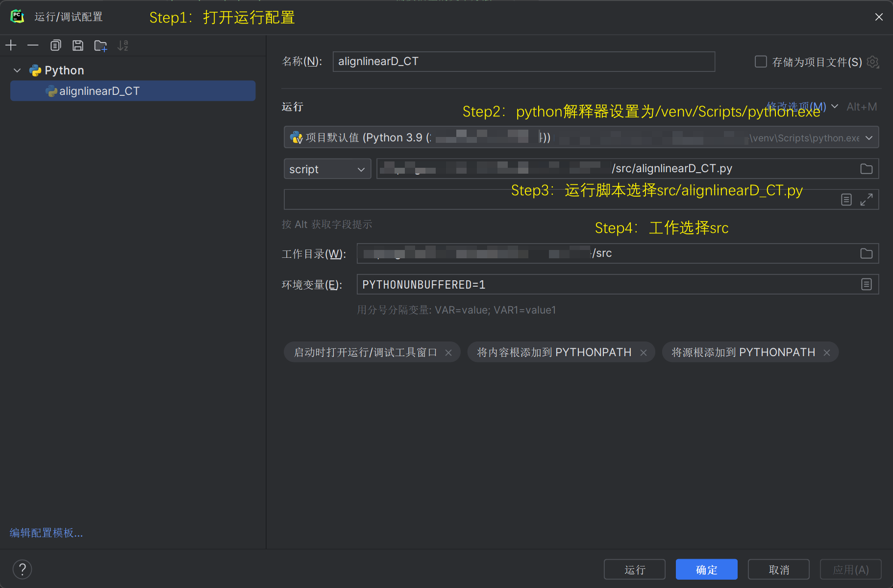

### **Project Directory**

```
Project Root Directory
├── assets/                             # Project resource folder
│   ├── original_code/                  # Original unmodified code
│   ├── paper/                          # Reference articles and methodologies
│   ├── param/                          # Provided parameter tables
│   ├── readme_assets/                  # Resources for project documentation
│   └── requirement/                    # Project task specification documents
├── result/                             # Directory for storing generated graphical results
├── src/                                # Source code folder
│   ├── alignlinearD_CT.py              # Main program simulating the alignment of linear molecules under an external laser field
│   ├── alignlinearmultipulses.py       # Handles molecular alignment calculations under multiple pulses
│   ├── alignlinearD_CT_DSIC.py         # Main program with correction terms included
│   ├── alignlinearmultipulses_DSIC.py  # Handles molecular alignment calculations under multiple pulses with correction terms
│   └── Wigner3j.py                     # Implements the Wigner 3j algorithm
├── src_en/                             # Source code folder
│   └── ……                              # English-annotated versions of files in the src folder
├── venv/                               # Project virtual environment
├── readme.md                           # Project introduction
└── requirements.txt                    # Environment configuration file
```

---

### **Example Code Execution**

The project environment is Python 3.9. It is recommended to use the Python interpreter within the virtual environment (`venv/Scripts/python.exe`) to run the code.

The Python interpreter configuration is shown in the figure below:



The following are the detailed steps to run the code:

1. **Install Dependencies**
   ```bash
   pip install -r requirements.txt
   ```

2. **Navigate to the Working Directory**
   ```bash
   cd src
   ```
  Alternatively, navigate to the English-annotated version directory, as both are equivalent.
   ```bash
   cd src_en
   ```

3. **Run the Main Program**:
   ```bash
   python alignlinearD_CT.py
   ```
   
    If you need to run the main program with correction terms included, execute:

   ```bash
   python alignlinearD_CT_DSIC.py
   ```

4. 4. **Check Output Results**:
   After execution, the program will automatically generate and save graphical results in the `result` folder. You can view the generated graphical files in the `result` directory.

---

### **Precautions**

- **Parameter Validation**
  - Before starting, make sure to modify the `molecule_dictionary` parameter in `alignlinearD_CT.py`.

- **Modification of Correction Terms**
  - If running `alignlinearD_CT_DSIC.py`, ensure that you modify the `lambda_dsic` parameter (the correction term constant λ) on line 75 of the file beforehand.

- **Wigner3j Code Optimization**
  - For details, see [Wigner3j_improve.md](assets/readme_assets/Wigner3j_improve.md).

- **Main Functions and DSIC Correction Term Code Explanation**
  - For details, see [explaination.md](assets/readme_assets/explaination.md).